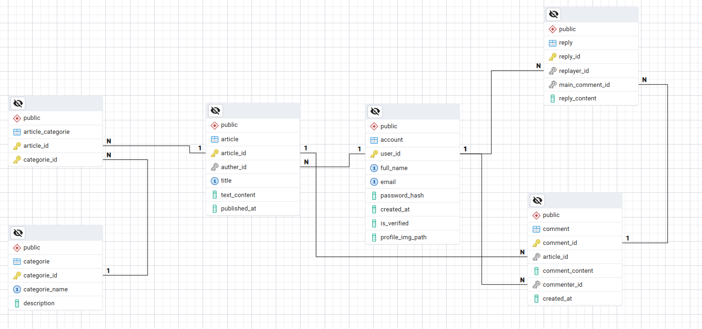

# WhyTMI

Tired of technical difinitions that need difinitions ? problem with no solution? you are in the right place , search for your problem or even post it and get feedback from all world wide! 

---

## 🛠️ Tech Stack
- **Frontend:** Next.js, React, TailwindCSS, Shadcn/UI  
- **Auth & Security:** jose (JWT)  
- **Database:** PostgreSQL (with pg-promise, no ORM)

---

## 🚀 Features
- Post questions and problems  
- Community-driven feedback  
- API-powered backend  
- Simple & clean UI  

---

## 📖 API Documentation

### Posts
| Method | Endpoint       | Description             |
|--------|----------------|-------------------------|
| POST   | `/apis/post`   | Create a new post       |
| DELETE | `/apis/post`   | Delete an existing post |
| PUT    | `/apis/post`   | Update an existing post |

### Comments
| Method | Endpoint          | Description                |
|--------|-------------------|----------------------------|
| POST   | `/apis/comment`   | Create a new comment       |
| DELETE | `/apis/comment`   | Delete an existing comment |
| PUT    | `/apis/comment`   | Update an existing comment |

### Authentication
| Method | Endpoint         | Description                |
|--------|------------------|----------------------------|
| POST   | `/apis/sign-in`  | Sign in with your account  |
| POST   | `/apis/sign-up`  | Create a new account       |

### User
| Method | Endpoint     | Description                          |
|--------|--------------|--------------------------------------|
| PATCH  | `/apis/user` | Update user info (name + password, not email) |

### Password Reset
| Method | Endpoint               | Description                 |
|--------|------------------------|-----------------------------|
| POST   | `/apis/reset-password` | Request password reset link |
| PATCH  | `/apis/reset-password` | Update password             |

---

## 🗂️ ERD (Entity Relationship Diagram)

Here’s the ERD of the project database:

 

---

## 📝 Notes
- **Reply table:** Exists in the ERD, but not yet implemented.  
- **Categories:** Based on the ERD, a post can belong to multiple categories, but in the current implementation each post has only **one category**.  
- **Email sending:** Emails are sent using **Gmail App** — this may cause some delay when creating a new account or resetting a password.  
- **Article vs Post:** The `article` table in the ERD corresponds to the `post` implementation in the Next.js code.  

---
